# Yala bien hecha para iPad

**Qué es:** qué ve hoy quien abre Yala en un iPad, qué desaprovecha, y cómo convertir la misma app
universal en una app de iPad de verdad, en fases. No es una app aparte: el proyecto ya compila para
iPad (`TARGETED_DEVICE_FAMILY = "1,2"`) y se instala tal cual.

**En corto:**

- **Hoy no se ve rota, se ve estirada.** iPadOS pone la barra de pestañas flotante arriba y la app
  funciona. Pero casi todas las pantallas son la columna del iPhone a 1000–1300 puntos de ancho: filas
  kilométricas, el importe lejísimos del concepto y, en horizontal, los botones flotantes tapan los
  importes.
- **Lo que más se echa de menos es la lista y el detalle a la vez.** Abrir un presupuesto, un grupo o
  un ajuste sustituye la pantalla entera y deja media pantalla vacía. Un registro se abre en una
  hoja que tapa la lista.
- **Hay más adaptado de lo que parecía.** El Panel pone sus tarjetas a dos columnas y Distribución
  pone los dos donuts lado a lado con el Sankey a todo lo ancho. Son el modelo a seguir.
- **Riesgo vivo: la app ya deja abrir varias ventanas en iPad** (`UIApplicationSupportsMultipleScenes
  = true`, medido en el `Info.plist` compilado), y la navegación es un único estado para todo el
  proceso. Dos ventanas de Yala comparten pestaña, cola de navegación y hojas abiertas. No se pudo
  reproducir en esta Mac (§2); se infiere del código con confianza alta.
- **La estructura propuesta** es la misma `TabView` con `.sidebarAdaptable`: barra de pestañas en
  iPhone, barra lateral en iPad, un solo código. Dentro, lista y detalle en dos columnas donde hay
  lista y detalle.
- **Cinco fases**, de S a L. La primera (barra lateral, ancho legible y lista-detalle en Registros y
  Planificación) ya cambia la sensación de la app. Tres piezas conviene resolverlas **ya en Cola B**
  para no rehacerlas (§8).

Convención: **medido** = lo vi en el simulador o lo leí en el código citado. **Inferido** = lo deduzco
del código sin haberlo visto pasar.

---

## 1 · Cómo se hizo

| | |
|---|---|
| Dispositivos | iPad Pro 13" (M5) e iPad mini (A17 Pro), iOS 26.5. Vertical y horizontal en los dos |
| Build | scheme `Yala`, Debug, sin cambios de código |
| Datos | ficticios y locales: `-uitest -uitest-reset -uitest-skip-onboarding -uitest-pro -uitest-seed realista` (730 días, 2316 registros). Grupos, con `-uitest-seed grupos -uitest-fake-icloud`. `-uitest` usa un store local sin CloudKit y no llama al backend |
| Recorrido | a mano con XcodeBuildMCP (Pro 13" vertical) y con un XCUITest temporal que gira el dispositivo y captura (el resto). El test no se commitea |
| Capturas | 45, en `docs/exploracion/ipad-nativo/`, JPEG a 1000 px (1400 en horizontal) |

**Lo que no se pudo medir:**

- **Split View y Stage Manager.** Esta Mac no tiene Simulator.app y `simctl` no sabe abrir una segunda
  app, redimensionar una ventana ni girar el dispositivo. Por eso el giro va por XCUITest. Lo que pasa en
  una ventana estrecha se **infiere**: el size class horizontal pasa a compacto y la app pinta la
  interfaz de iPhone, que es lo que hace el código hoy (`DS.Adaptive`, `DesignTokens.swift:409-430`).
- **Dos ventanas de Yala a la vez**, por lo mismo. El riesgo del §6 sale del código.
- **Yala IA** responde «no está disponible»: `-uitest` no llama al backend. Se ve el marco del chat, no
  una conversación.

---

## 2 · Estado actual, pantalla por pantalla

### Panel — *bien encaminado*

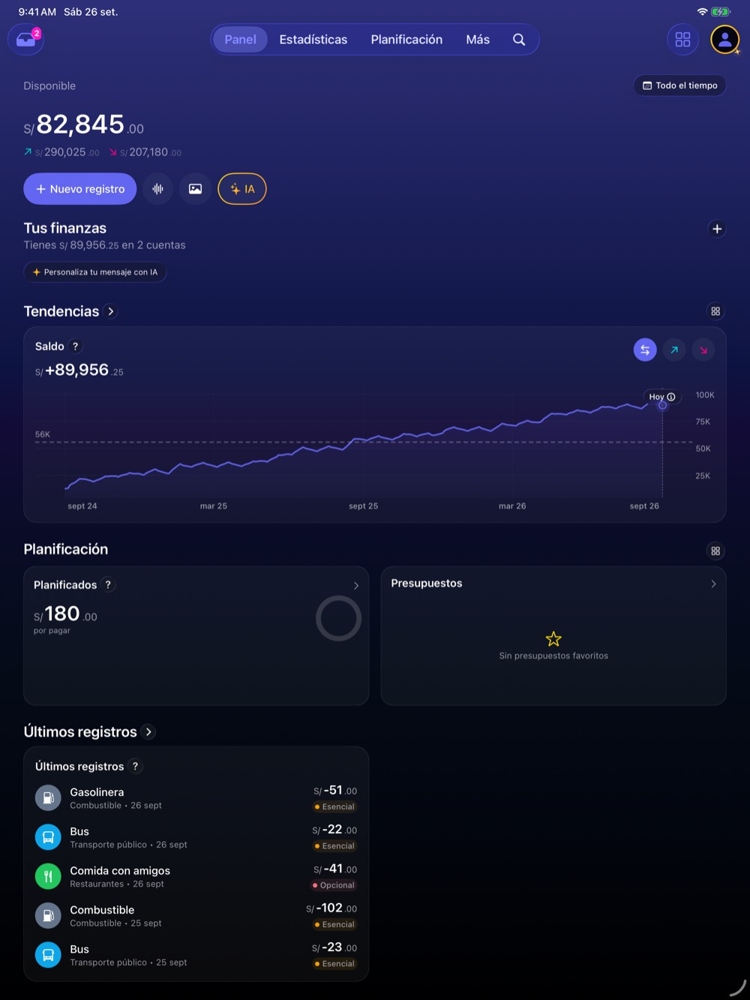

Medido: las tarjetas de Planificación van a dos columnas y las cuentas del carrusel pasan de 2 a 4
(`PanelWidgetsGrid.swift:24`, `AccountsCarouselView.swift:23`). La gráfica de saldo gana ancho útil.
Lo que desaprovecha: **Últimos registros** ocupa media fila y deja la otra media vacía; la cabecera
(saldo, acciones rápidas y «Tus finanzas») se lleva un tercio de la pantalla en horizontal
([Pro 13" horizontal](ipad-nativo/20-pro13-horizontal-panel.jpg)). En el mini vertical
([captura](ipad-nativo/40-mini-vertical-panel.jpg)) se ve casi igual que en el Pro: el mini ya es
«regular».

### Estadísticas · Resumen — *iPhone estirado*

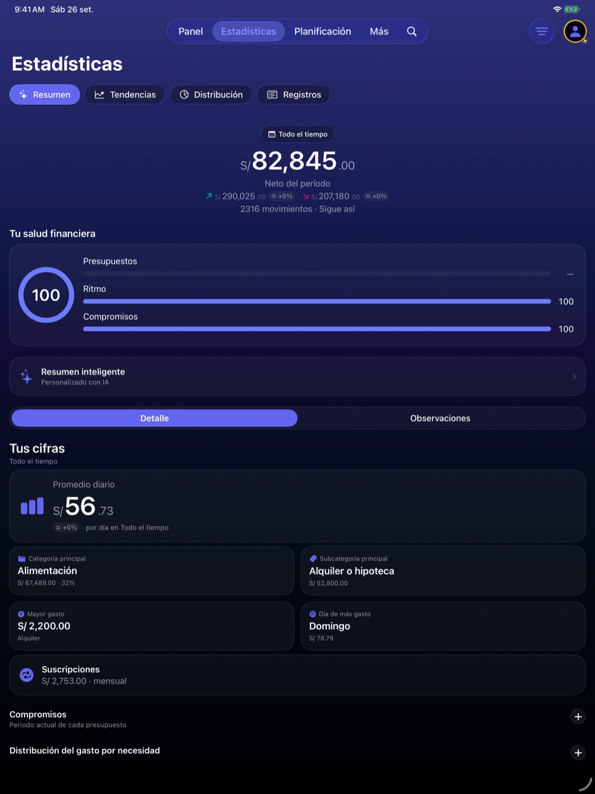

Las barras de «Tu salud financiera» miden unos 900 puntos para enseñar tres números. «Promedio diario»
y «Suscripciones» son tarjetas de ancho completo con una cifra cada una. El margen lateral es de 16
puntos, el del iPhone: existe un margen adaptativo de 32 (`DS.Adaptive.horizontalPadding`) pero tiene
**un solo uso** en todo `Yala/`.

### Estadísticas · Tendencias — *parcial*

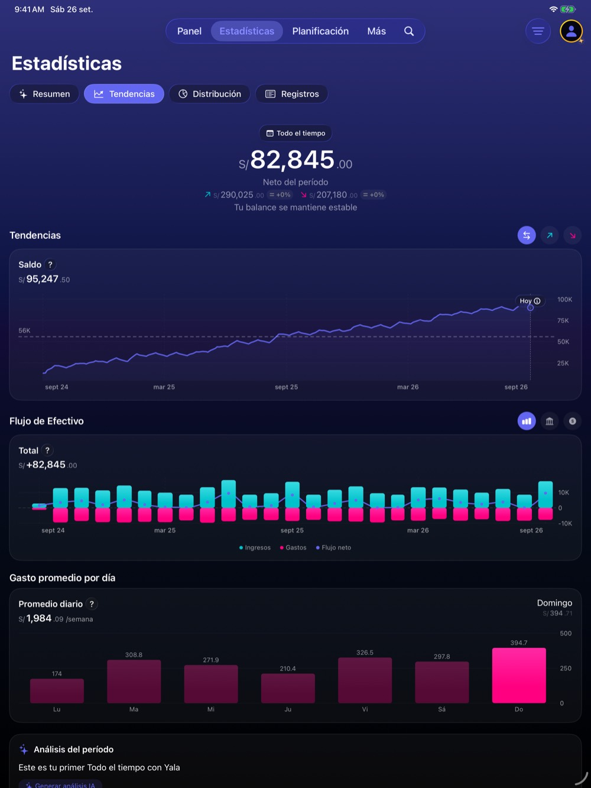

Medido: con la comparación activa, gráfica y comparación se ponen lado a lado (`TrendsTabView.swift:356`).
Sin comparación, todo va en una columna.

### Estadísticas · Distribución — *el modelo a seguir*

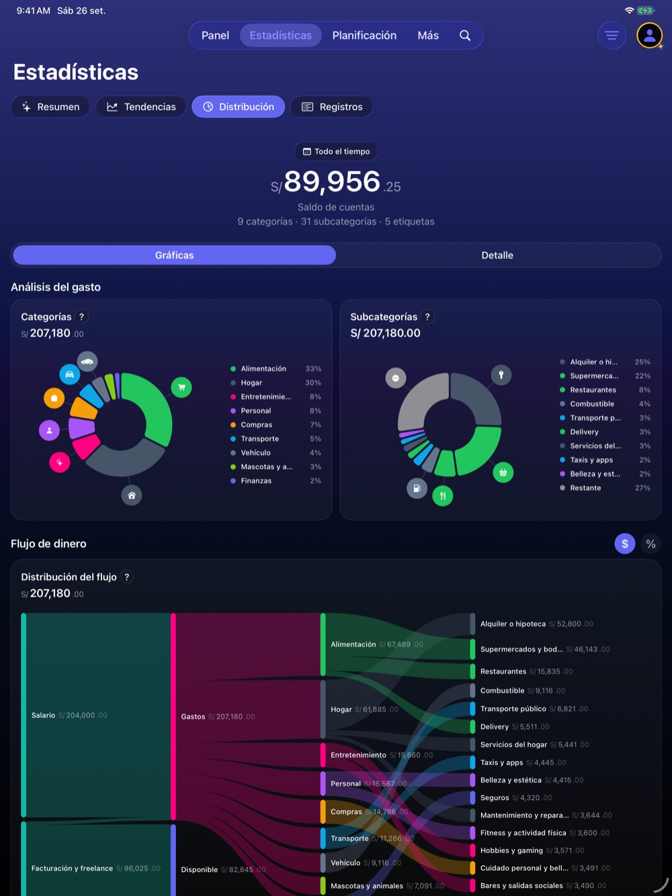

Dos donuts lado a lado y el Sankey del flujo de dinero a todo lo ancho, legible hasta la última
subcategoría. Es la única pantalla que ya parece pensada para iPad (`CategoriesTabView.swift:489`).

### Planificación y detalle de presupuesto — *falta lista-detalle*

| Lista | Detalle |
|---|---|
| 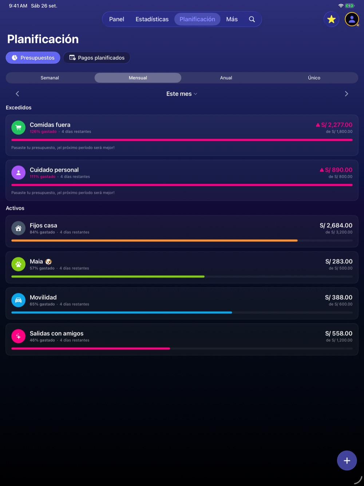 | 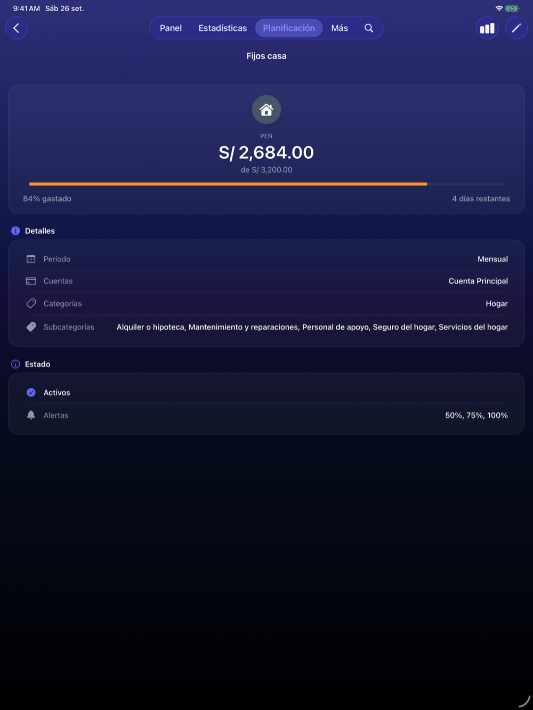 |

Las barras de progreso cruzan la pantalla entera. Al tocar un presupuesto, el detalle **sustituye** a
la lista y deja más de media pantalla vacía. En horizontal, el botón «+» tapa el importe del tercer
presupuesto ([mini horizontal](ipad-nativo/64-mini-horizontal-planificacion.jpg)).

### Más — *ya es una barra lateral, puesta en el sitio equivocado*

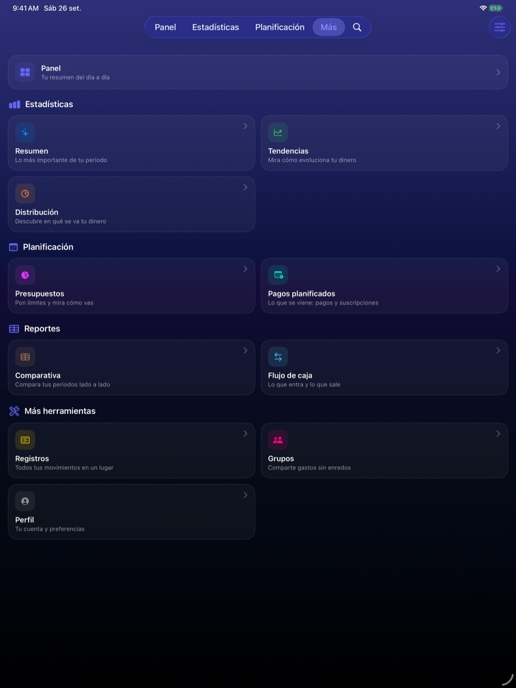

Once destinos agrupados en cuatro secciones (Estadísticas, Planificación, Reportes, Más herramientas).
Es exactamente el contenido de una barra lateral de iPad. Hoy es una pantalla a la que hay que ir.
Medido además: al tocar uno, la app crea una **pestaña temporal** (aquí «Registros» aparece en la
barra), que en iPad sería una entrada fija de la barra lateral.

### Registros y detalle de un registro — *lo que más gana*

| Lista | Detalle |
|---|---|
| 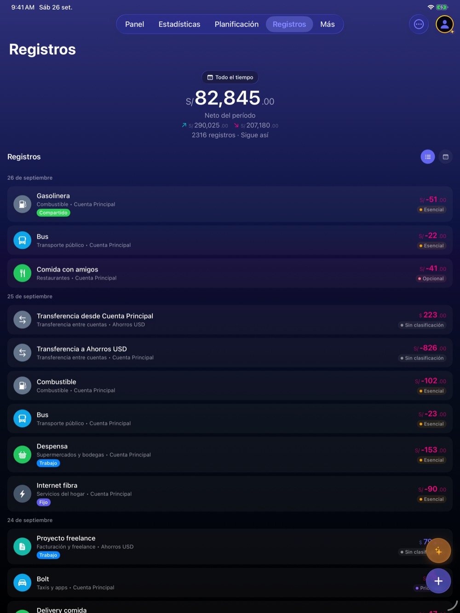 | 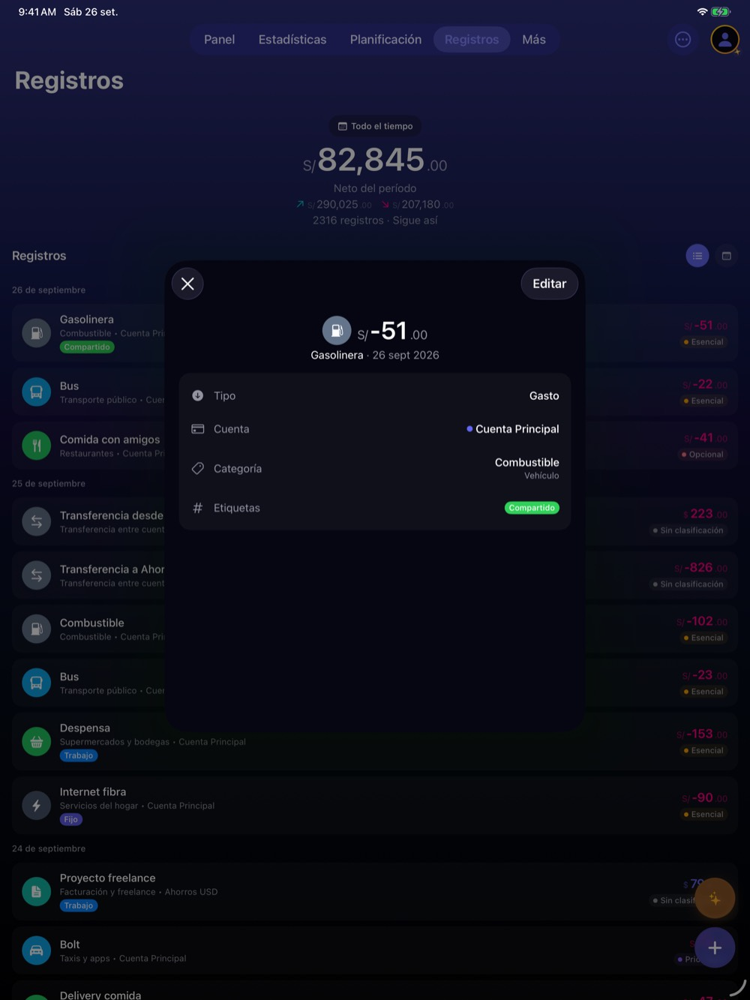 |

Cada fila mide todo el ancho: en horizontal, el concepto y el importe están a 1200 puntos
([captura](ipad-nativo/27-pro13-horizontal-registros.jpg)), y los dos botones flotantes (Yala IA y
«+») tapan los importes y la etiqueta de las filas de abajo. El detalle se abre en una hoja centrada
que tapa la lista y se queda con dos tercios vacíos. Es el caso de libro de lista-detalle.

### Nuevo registro — *correcto*

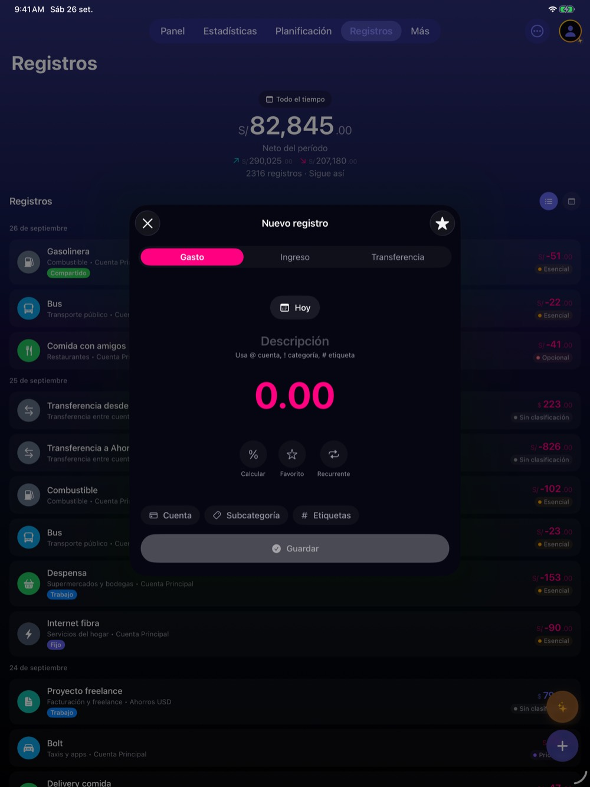

La hoja centrada funciona bien en iPad: el formulario es corto y tiene sentido encima de lo que
estabas mirando. El menú del «+» (Grupo, Voz, Imagen, Manual) se abre en abanico sobre la lista
([captura](ipad-nativo/10-pro13-vertical-nuevo-registro.jpg)). No hace falta cambiarlo; sí añadirle
atajo de teclado (§5.3).

### Yala IA — *hoja que tapa los datos*


El chat es una hoja modal: mientras hablas con Yala IA no ves los números sobre los que preguntas. En
iPad pide ser una **columna lateral** (un *inspector*) que convive con el Panel o con Registros.

### Perfil y Ajustes — *una hoja pequeña con navegación dentro*

| Perfil | Cuentas |
|---|---|
| 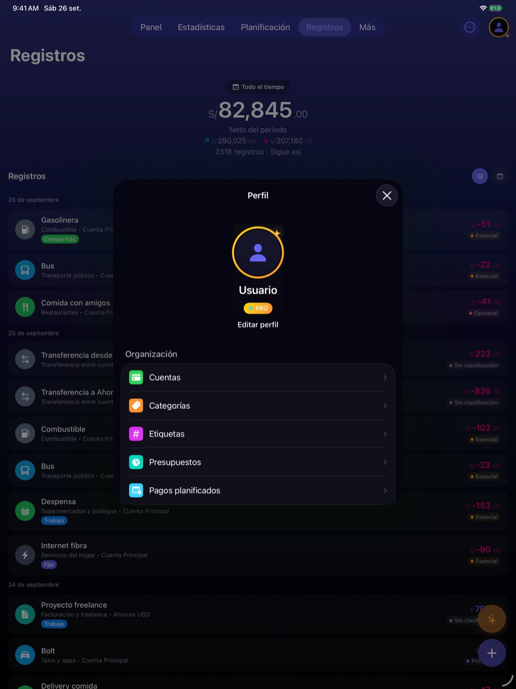 | 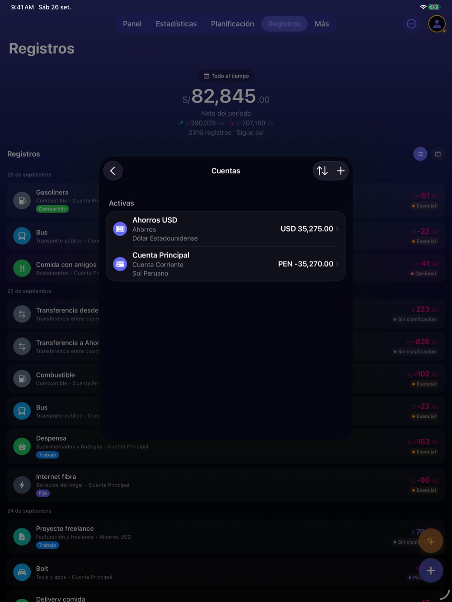 |

Todo Ajustes vive dentro de una hoja de 560 puntos con navegación por pilas. En iPad, Ajustes es la
pantalla de lista-detalle por excelencia (así es la app Ajustes del sistema).

### Grupos — *mismo patrón*

| Lista | Detalle |
|---|---|
|  | 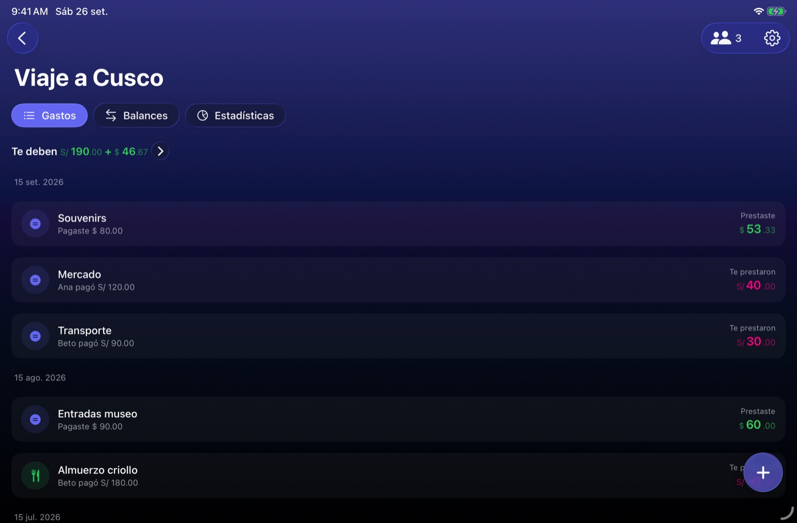 |

Dos grupos en tarjetas de ancho completo; al abrir uno, sustituye a la lista y la barra de pestañas
desaparece. El «+» tapa el importe de la última fila.

### Bandeja de entrada — *correcto*

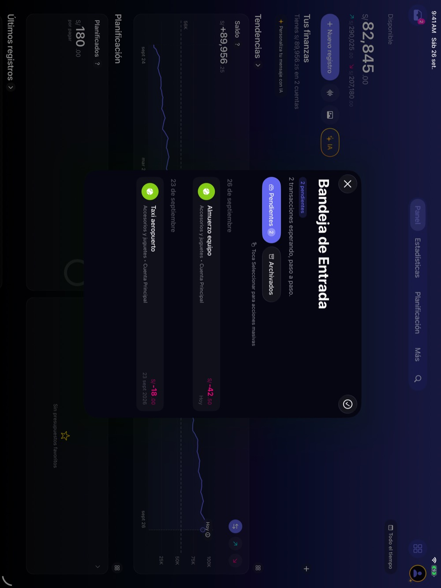

Hoja centrada con dos pendientes. Aceptable tal cual.

**Resto de capturas** (Pro 13" vertical `01`–`13`, Pro 13" horizontal `20`–`30`, mini vertical `40`–`50`, mini horizontal `60`–`67`, Grupos con datos `70`–`71`): en la
carpeta. Confirman lo mismo; el mini no se comporta distinto del Pro porque los dos son «regular» en
vertical y en horizontal.

---

## 3 · Lo que ya está bien (y no hay que romper)

- **La barra de pestañas flotante de iPadOS** ya aparece arriba sin hacer nada, con Buscar al final.
- **`DS.Adaptive`** (`DesignTokens.swift:409-440`): `isWideScreen`, `columns`, `horizontalPadding` y
  `sheetDetents`. La base existe; está infrautilizada.
- **Hojas grandes en iPad** (`usesLargeSheets`, 65 usos entre los dos helpers): por eso las hojas se
  ven como hojas de formulario centradas y no como el cajón del iPhone.
- **Sin anchos fijos peligrosos**: cero `UIScreen.main` y un solo `.frame(width:)` por encima de 300
  (el splash). El problema no es lo que está fijo, es lo que no tiene tope.
- **Orientaciones**: el iPad admite las cuatro (`project.pbxproj`, `UISupportedInterfaceOrientations_iPad`).

---

## 4 · Lo que se ve mal o desaprovecha el espacio

Ordenado por lo que más nota el usuario:

1. **No hay lista y detalle a la vez** en Registros, Planificación, Grupos ni Ajustes. Cada detalle es
   un viaje de ida y vuelta.
2. **Los botones flotantes tapan contenido en horizontal**: importes y etiquetas de Registros,
   Planificación y Grupos. Es un defecto, no una mejora.
3. **Ancho sin tope**: filas de 1300 puntos, barras de progreso de 900, un margen de 16. Falta un
   ancho legible (unos 700 puntos para listas y formularios) y el margen adaptativo.
4. **Yala IA tapa los datos** sobre los que preguntas.
5. **Más es una pantalla** cuando en iPad debería ser la navegación.
6. **Ajustes vive en una hoja pequeña** con pilas dentro.
7. **La cabecera del Panel y de Registros** (el saldo grande) se come un tercio de la pantalla en
   horizontal.
8. **Nada de teclado, puntero ni arrastrar** (conteos en §5.3).

---

## 5 · Propuesta de estructura para iPad

### 5.1 · Barra lateral + lista + detalle

```
┌──────────────┬───────────────────────┬──────────────────────────────┐
│ Panel        │ Registros             │ Gasolinera        S/ -51.00  │
│ ─ Estadíst.  │ 26 sep                │ Tipo       Gasto             │
│   Resumen    │  Gasolinera    -51.00 │ Cuenta     Cuenta Principal  │
│   Tendencias │  Bus           -22.00 │ Categoría  Combustible       │
│   Distribuc. │ 25 sep                │ Etiquetas  Compartido        │
│ ─ Planific.  │  Transferencia 223.00 │                              │
│   Presupues. │  ...                  │               [Editar]       │
│   Pagos      │                       │                              │
│ Registros ●  │                       │                              │
│ Grupos       │                       │                              │
│ ─ Reportes   │                       │                              │
│ Perfil       │                       │                              │
└──────────────┴───────────────────────┴──────────────────────────────┘
```

- **Raíz: la misma `TabView`, con `.tabViewStyle(.sidebarAdaptable)` y `TabSection`.** En iPhone sigue
  siendo la barra de pestañas de hoy; en iPad se convierte en barra lateral, y el usuario puede
  plegarla a pestañas arriba. El contenido de la barra lateral es el de **Más**: sus cuatro secciones
  son las `TabSection`. La pestaña «Más» y las pestañas temporales dejan de hacer falta en iPad.
- **Por qué no una `NavigationSplitView` raíz aparte:** duplicaría la navegación, y el `AppRouter`
  tendría dos consumidores por destino (`AppRouter.swift:23-28` hoy tiene uno por pestaña). Con
  `sidebarAdaptable` el enrutado sigue siendo por pestaña y el iPhone no cambia.
- **Dentro de las pestañas con lista y detalle** (Registros, Planificación, Grupos, Ajustes): una
  `NavigationSplitView` de dos columnas **solo en regular**; en compacto, la pila de hoy. El detalle de
  registro deja de ser hoja en iPad y pasa a la columna de detalle.
- **Ancho legible**: listas y formularios con tope (~700 pt) centrados cuando no hay columna de
  detalle; `DS.Adaptive.horizontalPadding` en todas las pantallas.
- **Pantallas que ya valen** (Panel, Distribución, Tendencias): no cambian de estructura; ganan el
  margen y alguna reordenación (Últimos registros a dos columnas, cabecera más baja en horizontal).

### 5.2 · Yala IA como inspector

En iPad, el chat se abre con `.inspector(isPresented:)`: una columna a la derecha que convive con la
pantalla. Preguntas «¿cuánto gasté en restaurantes?» mirando Distribución. En iPhone sigue siendo la
hoja de hoy. Pide que la vista del chat no dependa de estar dentro de una hoja (§8).

### 5.3 · Teclado, puntero, arrastrar y menús

Medido hoy: **0** `.keyboardShortcut`, **0** `.commands`, **0** `.hoverEffect`, **0** arrastrar y
soltar, **3** `.contextMenu` en toda la app.

| | Propuesta |
|---|---|
| Atajos | ⌘N nuevo registro · ⌘⇧N nuevo gasto de grupo · ⌘F buscar · ⌘K Yala IA · ⌘1…⌘6 secciones de la barra lateral · ⌘, Ajustes · ⌘E editar el registro abierto · ⌫ borrar con confirmación · ↑↓ recorrer la lista. Van en `.commands` para que salgan en el menú de ⌘ mantenido |
| Puntero | `.hoverEffect` en filas, tarjetas y chips; los botones de Liquid Glass ya lo traen |
| Menús contextuales | En filas de registro (editar, duplicar, cambiar categoría, borrar), presupuesto, grupo y cuenta. Sirven también con pulsación larga en iPhone |
| Arrastrar y soltar | Soltar una imagen o un PDF de recibo sobre Yala abre Nuevo registro por imagen (el flujo ya existe). Arrastrar un registro fuera lo exporta como texto. Soltar un registro sobre una cuenta de la barra lateral queda **fuera** de propuesta: mover dinero de cuenta con un gesto es demasiado fácil de hacer sin querer |

### 5.4 · Multitarea y ventanas

- **Split View y Stage Manager**: con size classes bien usados, una ventana estrecha es la interfaz
  de iPhone y una ancha es la de iPad. No pide pantallas nuevas; pide probarlo (no se pudo aquí).
- **Varias ventanas**: útil de verdad (Registros en una, Estadísticas en otra; abrir un grupo en
  ventana propia). Pero exige estado por ventana, que hoy no hay (§6). Va en la fase 4.

### 5.5 · Widgets grandes

Medido: tres widgets admiten `.systemLarge` (los dos donuts y Flujo de caja) y **ninguno**
`.systemExtraLarge`, que es solo de iPad. Propuesta: `.systemLarge` para Presupuestos, Últimos
registros y Pagos planificados, y un `.systemExtraLarge` «Resumen del mes» (saldo, gasto por
categoría y presupuestos en una pieza). Ojo al DTO del App Group: está duplicado entre app y widgets.

---

## 6 · Riesgos técnicos

### 6.1 · La multiventana ya está encendida, y la navegación es de proceso — **alto**

**Medido:** el `Info.plist` compilado trae `UIApplicationSupportsMultipleScenes = true` (lo pone
`INFOPLIST_KEY_UIApplicationSceneManifest_Generation = YES`), y la app tiene un solo `WindowGroup`
(`YalaApp.swift:81`). Un usuario de iPad puede abrir hoy una segunda ventana de Yala desde el Dock o
el App Exposé.

**Medido:** todo el estado de navegación es un singleton de proceso:

- `MainTabView` se ata a `SessionState.shared` y hace `TabView(selection: $sessionState.selectedMainTab)`
  (`ContentView.swift:3044` y `:3053`).
- `SessionState` guarda una sola pestaña, un solo modal y una sola hoja de bandeja
  (`selectedMainTab` :619, `shellModalBlocker` :481, `isMainTabModalVisible` :487,
  `isInboxSheetVisible` :473).
- `AppRouter` tiene una sola cola de intents y un solo juego de consumidores (`AppRouter.swift:36-45`).
- Cero `@SceneStorage`, cero `openWindow`.

**Inferido (confianza alta):** con dos ventanas, cambiar de pestaña en una la cambia en la otra; un
widget o un enlace que empuja un intent lo consume la ventana que llegue primero; una hoja «visible»
en una ventana bloquea el enrutado en las dos.

**Efecto en la sync (inferido):** los datos no se duplican — hay un solo `ModelContainer` por proceso
(`PersonalContainerHost`), un solo observador de CloudKit y un solo motor de sync, y las dos ventanas
leen lo mismo. El riesgo está en los **flujos con pantalla terminal**: el swap de contenedor al cerrar
sesión remonta todas las ventanas a la vez (`YalaApp.swift:90-97`), y la red de `exit(0)` en segundo
plano ya se diseñó pensando en esto (usa el `scenePhase` agregado, `YalaApp.swift:172-173`). Lo que no
está pensado es que el cover de cierre o el de «Un momento más» se enseñe en una ventana y la otra
siga operando.

**Qué hacer:** medirlo en un iPad real (el ticket trae el guion) y, si se confirma, **apagar la
multiventana** (`UIApplicationSupportsMultipleScenes = NO`) hasta la fase 4. Es una línea y no le
quita nada que funcione bien hoy.

### 6.2 · El router y las pestañas cambian de forma con la barra lateral — **medio**

Pasar a `TabSection` cambia qué es una «pestaña»: hoy hay 3 configurables + Más + temporal + Buscar
(`TabBarConfiguration.swift:68-130`). En iPad, las once entradas de Más serían pestañas fijas. El
`AppTab` y los consumidores del `AppRouter` tienen que admitir destinos que hoy solo se alcanzan
empujando dentro de Más. Hay que decidir qué pasa con la configuración de pestañas del usuario en
iPad (propuesta: en iPad se ignora, la barra lateral lo enseña todo).

### 6.3 · Hojas que pasan a columnas — **medio**

Hay **275** `.sheet(` en 101 ficheros. No hay que tocarlos todos: solo los que son detalle (registro,
presupuesto, cuenta, grupo). Pero cada uno que pasa a columna pierde el ciclo de vida de la hoja
(`onDismiss`, `isMainTabModalVisible`), y hay lógica colgada de él: el detalle de registro encadena
el editor al cerrarse (`DetailContainerView.swift:768`).

### 6.4 · Rendimiento — **bajo, con dos puntos a vigilar**

- **Gráficas más anchas = más puntos pintados.** La de saldo ya dibuja 731 puntos; el Sankey pinta
  31 subcategorías. En un iPad son rápidas, pero con dos ventanas y un inspector se multiplican las
  vistas vivas. Medir con Instruments en la fase 1.
- **Tres columnas vivas** mantienen más `@Query` montadas a la vez. El comentario de `YalaApp.swift`
  cuenta 67 `@Query`; una columna de lista y otra de detalle las duplican en pantalla. No es un
  problema de iPhone.

---

## 7 · Encaje con Cola B

«Cola B» no existe como campo en los tickets (medido): se deduce de la tanda de rediseño de UI de
septiembre. Los que chocan o encajan con iPad:

| Ticket de Cola B | Qué hacer ya «pensando en iPad» |
|---|---|
| `settings-redesign-as-grouped-lists-like-ios` | Hacerlo con `List` y estilo agrupado del sistema, **no** con tarjetas propias: así la misma lista vale como columna de una `NavigationSplitView` en iPad sin rehacerla |
| `ai-chat-reads-heavier-than-a-messaging-app` | Que la vista del chat no asuma que vive en una hoja (ni tirador, ni cierre propio dentro del hilo): es la que irá al inspector en iPad |
| `account-form-as-medium-detent-sheet` | En iPad el detent medio **no se aplica**: `usesLargeSheets` fuerza `.large`. Decidirlo a propósito — la hoja de formulario centrada ya es el equivalente — en vez de descubrirlo en QA |
| `panel-accounts-redesign` | «Clic abre sheet, editar dentro»: en iPad, que el detalle de cuenta pueda ir en columna |
| `more-tab-missing-profile-button` | Más desaparece como pantalla en iPad. El botón de perfil sí sirve en iPhone; no invertir en rediseñar Más como pantalla |
| `after-session-redesign-review-widgets-siri-applepay-and-web-copy` | Al revisar widgets, dejar el DTO listo para `.systemLarge`/`.systemExtraLarge` (§5.5) |
| `trends-insight-card-v2-bullets` | Ya prevé una columna en iPad ancho: mantenerlo |

Y dos piezas que no son de ningún ticket de Cola B pero conviene meter ahí porque tocan las mismas
pantallas: **los botones flotantes que tapan importes** y **el ancho legible** (§4, puntos 2 y 3).

---

## 8 · Plan por fases

Tamaños: **S** ≈ una sesión · **M** ≈ dos o tres · **L** ≈ cuatro o más.

| Fase | Qué cambia para el usuario | Tamaño | Cuándo | Ticket |
|---|---|---|---|---|
| **0 · Riesgo vivo** | Nada visible: si se confirma el problema, deja de poder abrir una segunda ventana rota | S | ya, independiente | `ipad-multiple-windows-share-one-navigation-state` |
| **Cola B** | Los botones flotantes dejan de tapar importes; listas y ajustes con ancho legible; los rediseños de Cola B ya nacen válidos para iPad | S + checklist | con Cola B | `floating-buttons-cover-row-amounts-on-ipad-landscape`, `cola-b-redesigns-must-hold-up-at-ipad-width` |
| **1 · Barra lateral y lista-detalle** | Barra lateral con todas las secciones; Registros y Planificación con lista y detalle a la vez; el detalle de registro en columna; ancho legible en todo | L | tras 2.1 | `ipad-sidebar-and-list-detail-for-records-and-planning` |
| **2 · El resto de lista-detalle y Yala IA al lado** | Grupos y Ajustes en dos columnas; Yala IA como columna lateral que convive con los datos; Panel y cabeceras reordenados para horizontal | M | tras la 1 | `ipad-list-detail-for-groups-and-settings-and-chat-inspector` |
| **3 · Teclado, puntero y menús** | Atajos (⌘N, ⌘F, ⌘K, ⌘1…), resaltado al pasar el puntero, menús contextuales en filas, soltar un recibo para registrarlo | M | tras la 1 | `ipad-keyboard-shortcuts-pointer-context-menus-and-drop` |
| **4 · Varias ventanas de verdad** | Abrir un grupo, un registro o una sección en otra ventana; Split View y Stage Manager probados | L | cuando haya demanda | `ipad-real-multiwindow-with-per-scene-state` |
| **5 · Widgets grandes** | Widgets grandes de Presupuestos, Últimos registros y Pagos; uno extragrande de resumen del mes | S–M | cuando se quiera | `ipad-large-and-extra-large-widgets` |

**Orden y dependencias:** la fase 0 no depende de nada. La 2 y la 3 dependen de la 1 (necesitan la
barra lateral y las columnas). La 4 depende de la 0 (si se apagó la multiventana, se vuelve a
encender aquí, con estado por ventana). La 5 es independiente. Si solo se hiciera una, la **1**.

**Cada fase termina con:** captura antes/después en los dos iPad y en iPhone (el iPhone no debe
cambiar), XCUITest de navegación en un destino iPad, y el pase de estrés del `CLAUDE.md` en el mini y
el Pro 13".

**ADR pendiente:** la estructura del §5.1 es una propuesta. Cuando Jürgen la apruebe, la fase 1 la
deja escrita como ADR antes de empezar.
