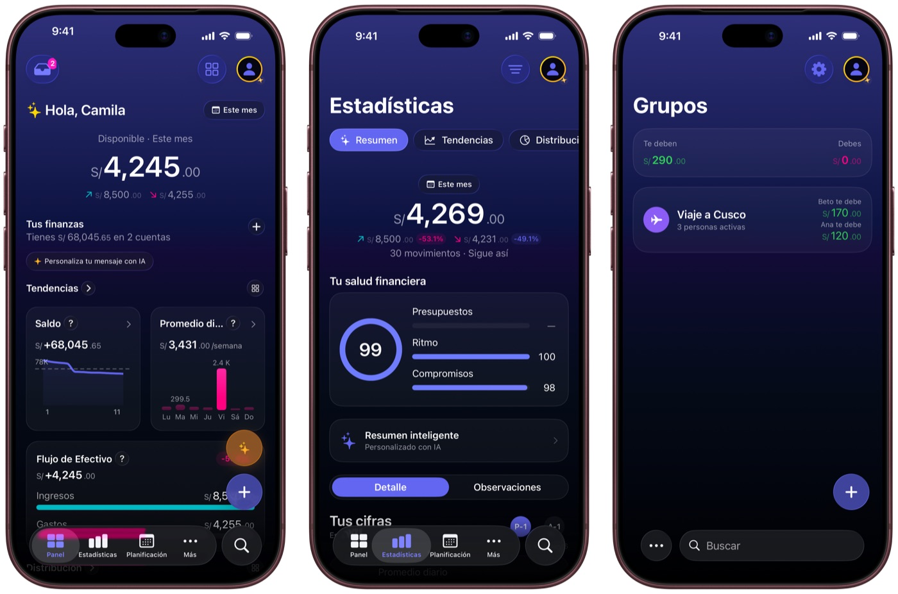

# Frames CLI — marco oficial de iPhone para capturas y grabaciones

**Veredicto (2026-09-30): funciona y vale para las demos de Yala.** Pone el bezel oficial de
Apple a una captura o a una grabación del simulador en menos de un segundo por imagen y unos
5 s por clip de 14 s. Lo probé en la Mini con la versión 1.5.0.

Frames CLI es de Federico Viticci (MacStories), con licencia MIT y gratis. Repo:
<https://github.com/viticci/frames-cli>.



## Dónde encaja

```
simulador (simctl / XcodeBuildMCP)  →  Frames CLI (bezel)  →  Remotion (animación)
        captura o grabación               PNG / MP4 / MOV          cámara, texto, ritmo
```

**Remotion sigue siendo la capa de animación.** Frames solo pone el marco: no mueve nada, no
rotula y no compone escenas.

Hoy Remotion dibuja su propio teléfono en `remotion/src/components/DeviceFrame.tsx`. Sustituirlo
por un vídeo ya encuadrado con Frames es posible, porque Frames exporta con transparencia. Esa
decisión **no está tomada**: aquí solo queda probado que el marco sale bien.

## Instalar

Requisitos: Python 3.8+, Pillow y, para vídeo, ffmpeg/ffprobe 5.1+. En la Mini ya estaban los
tres.

```bash
git clone https://github.com/viticci/frames-cli.git ~/.local/share/frames-cli
pip3 install Pillow
ln -sf ~/.local/share/frames-cli/frames ~/.local/bin/frames
frames --version          # frames v1.5.0
```

Los marcos van en un pack aparte de unos 60 MB. `frames setup` sin argumentos lo descarga, pero
**solo en una terminal interactiva**: desde un agente o un script se queja y para. Entonces se
baja a mano y se le pasa la carpeta:

```bash
URL=$(grep -m1 '^ASSETS_URL' ~/.local/share/frames-cli/frames | cut -d'"' -f2)
mkdir -p ~/.local/share/frames-assets
curl -sL --fail -o /tmp/af.zip "$URL" && unzip -q /tmp/af.zip -d ~/.local/share/frames-assets && rm /tmp/af.zip
frames setup ~/.local/share/frames-assets/Frames
frames doctor             # debe decir "OK" y contar 287 PNG de marcos
```

Para actualizar: `git -C ~/.local/share/frames-cli pull` y repetir lo del pack si el CHANGELOG
dice que trae marcos nuevos.

## Uso

El dispositivo se detecta por el tamaño de la imagen. Las capturas del simulador iPhone 17 Pro
(1206 × 2622) salen con **iPhone 18 Pro** por defecto, que es lo que pedimos.

```bash
# Una captura → panel-hero_framed.png al lado
frames panel-hero.png

# Color concreto: Burgundy, Glacier, Silver o Black
frames -c Glacier -o salida/ captura-voz.png

# Tres capturas en una sola imagen, lado a lado
frames -m -c Burgundy -o salida/ panel-hero.png stats-resumen.png grupos-lista.png

# Por lotes: de dos en dos
frames -b 2 -o salida/ *.png

# Grabación del simulador → MP4 con marco
xcrun simctl io booted recordVideo --codec=h264 rec.mp4    # Ctrl-C para parar
frames video --preset balanced -o salida/ rec.mp4

# El mismo vídeo con fondo transparente, para meterlo en Remotion
frames video --codec hevc-alpha -o salida/ rec.mp4          # → .mov
```

`frames info <fichero>` dice qué marco va a usar sin renderizar nada.

## Lo que salió en la prueba

| Prueba | Entrada | Resultado |
|---|---|---|
| Captura suelta | `generator/public/screenshots/es/panel-hero.png` | PNG 1350 × 2760 con alfa, iPhone 18 Pro Burgundy. Máscara de esquinas e isla bien alineada |
| Color | `captura-voz.png` con `-c Glacier` | Correcto |
| Merge | 3 capturas con `-m` | 4170 × 2760, la muestra de arriba |
| Lote | 4 capturas con `-b 2 -c random` | 2 imágenes de 2760 × 2760 |
| Vídeo H.264 | Grabación de 14 s del simulador (Ajustes, sin datos) | MP4 1350 × 2760 en 5 s; el contenido queda dentro del marco |
| Vídeo con alfa | El mismo, `--codec hevc-alpha` | MOV HEVC. **El alfa no lo verifiqué**: `ffprobe` no ve la capa auxiliar de transparencia, y el propio README lo avisa. Hay que abrirlo en QuickTime o meterlo en Remotion antes de fiarse |

Las capturas de la prueba son las del generador, con datos de ejemplo («Camila»). Las salidas
completas no se commitean; la muestra de arriba es un JPG reducido.

## Límites

- **El pack de marcos no va al repo.** Lo cubre la *Apple Design Resources License*, que prohíbe
  redistribuirlo. Lo que sí se puede publicar es el mockup que sale, que es justo para lo que
  Apple lo licencia.
- **Duo no aplica a Yala.** Frames 1.5.0 trae iPhone Duo como experimental, para capturas del
  simulador de Xcode 27.1. Yala no tiene diseño para Duo, así que no lo probé.
- **El marco no arregla la captura.** Si la pantalla trae status bar sucia, tema equivocado o
  datos de alguien, sale igual de mal pero con bezel. Las reglas de la toma siguen siendo las de
  `remotion/docs/OPERACION.md`.
- **Las capturas del generador envejecen.** Las de la prueba son de una versión anterior de la
  app. El frente de capturas semanales desde el simulador las sustituirá; Frames se aplica igual.
- **Arranca el simulador del todo antes de grabar.** La primera grabación de la prueba salió con
  el logo de arranque: `simctl bootstatus` vuelve antes de que el SpringBoard esté listo.
- El repo trae una skill para agentes (`skill/SKILL.md`). No la instalé: el CLI se usa bien sin ella.
